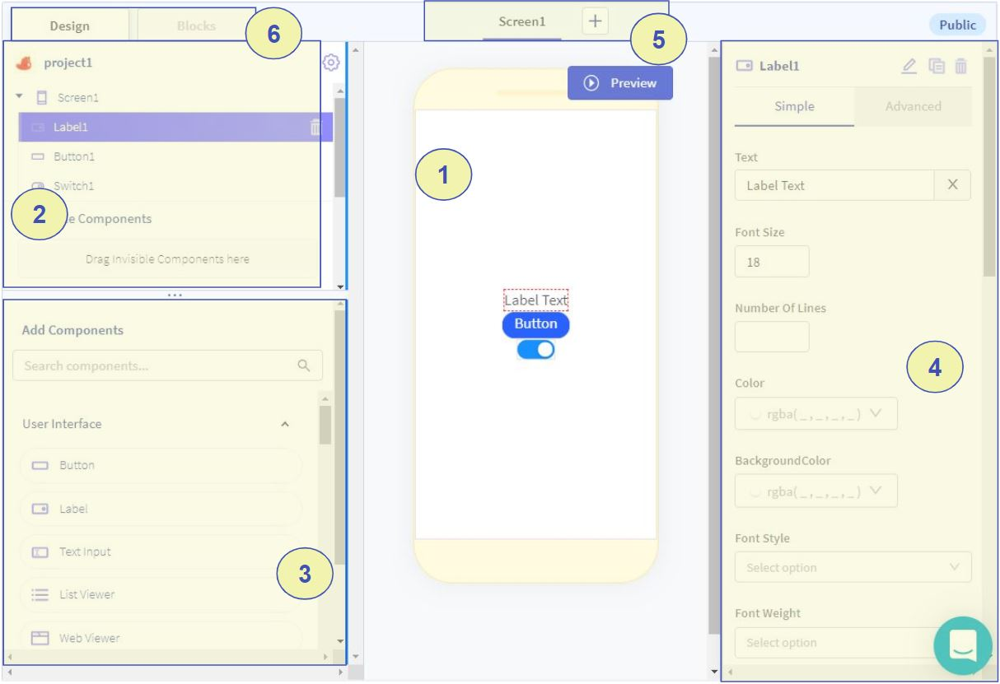

# Thunkable App Designer

When starting a new project, the app Designer page will open. This page is where the app's components are added. The major sections of the page are numbered in this image:

The numbered sections are:

1. Screen Viewer - View of the selected app screen, this shows what the screen will look when the app is opened.
2. The App Tree Section - Shows the list of components in the app, they can be reordered to change their location on the screen or change which screen they are on.
3. App Components Section - List of components that can be added to the app. Components can be dragged and dropped from the App Components Section into the Screen Viewer to add them to the app.
4. Component Properties - Contains editable properties for the selected component. Components can be selected in the Screen Viewer or the App Tree Section.
5. Screen Selector. An app can have multiple screens. A new screen can be added with the '+' button. Clicking the name of a screen here opens that screen so components can be dragged into it.
6. Tabs to switch between Designer and Blocks Editors - Clicking on the Blocks tab will open the Blocks Editor, leaving the Designer page.

### Continuing

Click the "Next" button below to view information about the Blocks Editor.