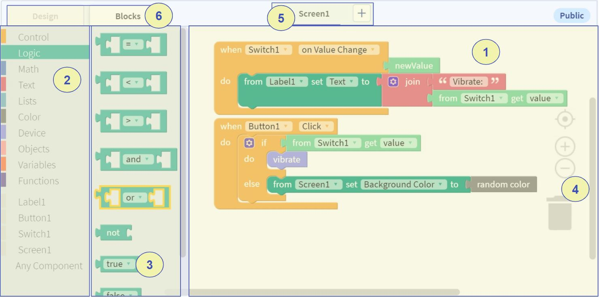

# Thunkable Blocks Editor

The Blocks Editor is where a user can program all the app's functions - the things that <b>happen.</b> The major sections of the page are highlighted here:

The numbered sections are:

1. Blocks view - The location for active blocks. All functionality, anything that <b>happens</b> in a given screen must be defined by combining blocks here.
2. Drawer List - List of drawers that contain blocks. The drawers are named based on the type of functionality that their blocks have. drawers at the bottom, without colors next to them, contain functionality for the Components that are in the selected screen.
3. Drawer Blocks - List of blocks in the selected drawer. Blocks can be dragged from the drawer into the blocks view to add their functionality to the screen. The act of dragging blocks into the blocks view and clicking them together is the coding process for making things happen in a Thunkable app.
4. Extra Tools - Drawers can be dropped into the garbage can here to remove them (or clicking "delete" when a drawer works similarly). The zoom buttons can be used to change magnification of the view.
5. Screen Selector. Works the same as the Screen Selector in the App Designer screen, allows for viewing Blocks in different screens.
6. Tabs to switch between Designer and Blocks Editors

### Continuing

Click the "Next" button below to view information about saving and testing your app.