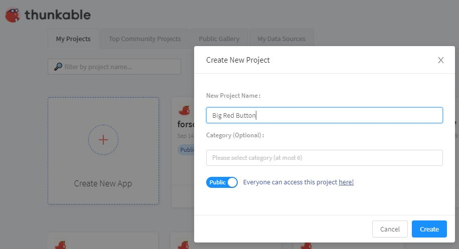

# Big Red Button

This first lesson will be a very quick introduction to the Thunkable interface, and a couple of the basic skills to create an app with Thunkable.

Skills used:

* Adding components to an app
* Setting component properties
* Adding blocks to handle events

### Prerequisites

See [basics/get started](../basics/basics-01-get-started.md) for information about logging in.

After signing in, create a new project called `Big Red Button`

### Output

The resulting app will feature a Big Red Button. When clicked, the button will do ... <b>something.</b>