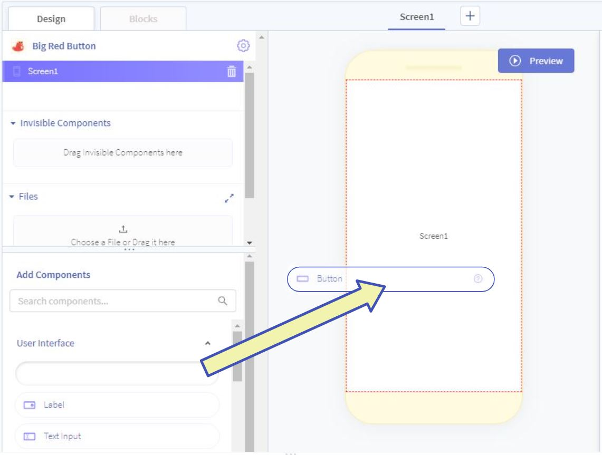
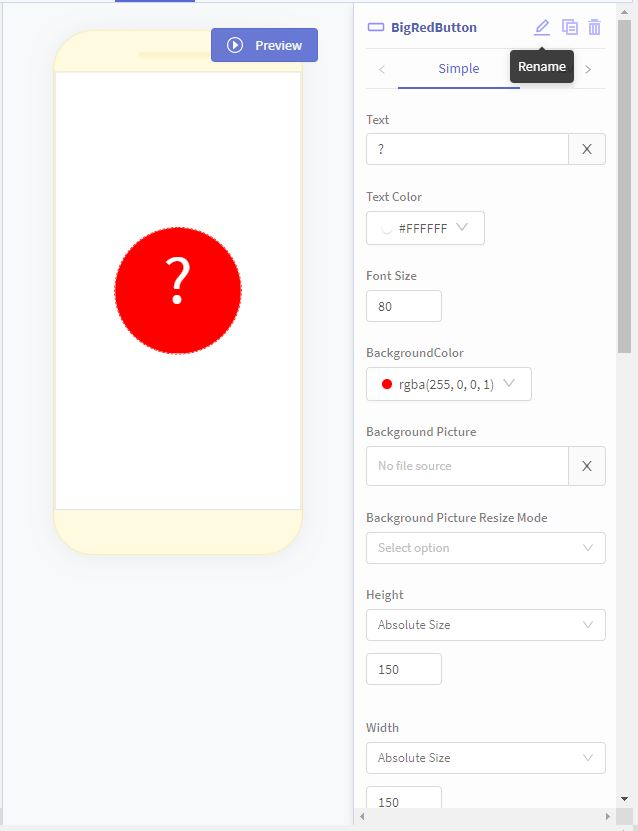

# Adding the Big Red Button
In this step, you will add a button to the screen, and then change it into a Big Red Button.

[TOC]

### Add a button
Drag the `Button` item from the components tray on the left onto the screen viewer.

### Edit the button
In order to change the way the button looks, it needs to be selected. Select the button by either:

* Clicking on the button in the screen viewer
* Clicking the name of the button in the App Tree in the upper left of the screen

After selecting the button, it should show up in the component properties section on the right side of the screen. In order to make the button big, red, and <i>mysterious</i>, we will change some of the button properties:

* Rename the button: `BigRedButton`
* Change the `Text` to say "?"
* Set `Font Size` to `80`
* Change the `BackgroundColor` to red
* Set `Height` to "Absolute Size" 150
* Set `Width` to "Absolute Size" 150

The button settings should look something like this:

### Add a label
Drag a `Label` item from the components tray onto the screen viewer, the same way the button was added.

### Edit the label
Change it to something to get somebody to click your button! `Click Me!` is straight to the point.

### Next Step
The screen now looks exactly how we want it! You can take a look at it by [testing it.](../basics/basics-04-testing-saving.md) Unfortunately, the button does not do anything yet! Click the "Next" button below to program your button.