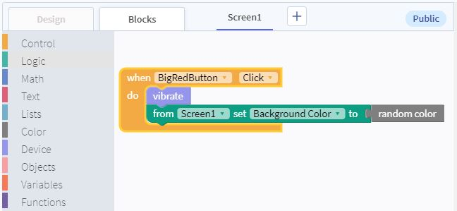

# Programming the Big Red Button
In this step, you will tell your app what to do when the button gets clicked!

### Switch to the Blocks editor
Above the components on the left, click the `Blocks` tab. This is where all the programming happens. Anything that you want the app to do has to be added in here.

### Add a handler for clicking the BigRedButton

On the left is a list of all the drawers with different programming blocks. They are sorted by category of block.

The drawers that are for components in the app are on the bottom of the drawer list. In order to do something when the Big Red Button is clicked, open the `BigRedButton` tray on the left.

We want something to happen when the BigRedButton is clicked, so grab the block that will do something when the BigRedButton is clicked.

### Add events

Notice the `do` part of the block is empty! Here we tell the app what to do when the button is clicked.

The first thing we will do is have the app make your device vibrate. In the `device` drawer, find the "vibrate" block and drag it into the "When BigRedButton clicked, do ____" block.

We also want the screen's background color to change to a random color when the button is clicked. See if you can find the blocks for

* Setting "Screen1" background color
* A random color

These can be fitted together below the "vibrate" block inside the "When BigRedButton clicked" block.

After adding the blocks, the blocks editor will look something like this:

### Next Step
On the next page you will find ideas and instructions for adding different actions to the button. Click the "Next" button below to continue.
