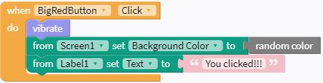
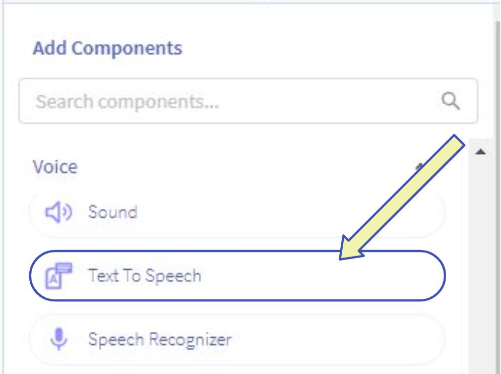
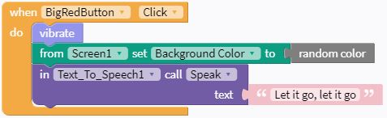
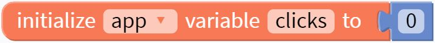
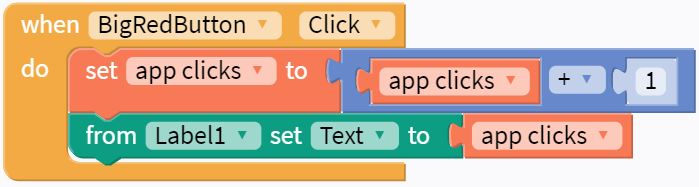

# Programming the Big Red Button - Actions

There are a lot of things you can have your app do! This page has a list of options, all of which use different skills that will be useful for building more complex apps!

### Change the Label
Just like changing the screen's background color, other components properties can be changed by blocks. Combine blocks in a way that will change what the label says when the button is clicked.

??? success "Solution"
    

### Play a sound
The app can play audio files or sounds. As a sample, there is an audio file [here](../../sounds/watch-alarm.mp3) that can be downloaded and then added to the app. After opening that link, the 3 dots on the right side can be clicked to download.

A new Component needs to be added to the app, so navigate back to the Design tab and look in the components list for the "Sound" component. After dragging it into the app, you can select it (in the app tree on the upper left, or at the bottom of the app screen viewer) and change its properties. The "Source" property is where the downloaded file will need to be uploaded.

Back in the Blocks tab, there will now be a Drawer of blocks for the new Sound component. The "in Sound, call Play" block can be added to the "when button clicked" block.

### Text to speech: say something!
Can you get the app to say something out loud? Maybe it can sing your favorite Disney song?

Hint: Another new Component will need to be added on the Design screen

??? success "Solution"
    Here is the component that needs to get added to the app:
    {: style="width:400px"}

    Here are the blocks using the text-to-speech component:
    {: style="width:450px"}

### Count the number of clicks

We can set up the label to count the number of times the button is clicked! This action will use a `variable`.

In the Blocks editor, in the Variables drawer, there is a block you can use to initialize your variable.

{: style="height:45px"}

Can you figure out how to add `1` to your variable `clicks` every time the button is clicked? Then, can you figure out how to set the Label to show the number of clicks?

??? success "Solution"
    {: style="width:400px"}