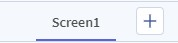
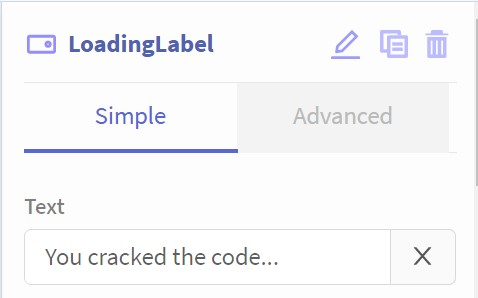

# Screen Creation and Renaming

In this step, you will create a second screen, and rename your screens.

To begin, open your BigRedButton application or create a new app.

### Creating a new screen
In the center-top of the page, above the App Screen Viewer, locate the Screen Selector (see image below).

To create a new screen, click the `+` button. Your Screen Viewer should automatically switch to a new screen without any components.

### Renaming screens

The names `Screen1` and `Screen2` are not very descriptive, so we will rename them so that they make more sense.

Select the name of the original screen, it is probably `Screen1`. The Component Properties section on the right side of the page should now have the properties for the screen. Clicking the pencil at the top of the properties, rename the page to `LoginScreen`.

{: style="width:300px"}

Next, do the same with `Screen2`, renaming it to `LoadingScreen`. The Screen Navigation bar should look similar to this:

{: style="width:350px"}

### LoadingScreen Content
Lets add a `Label` component to the Loading Screen, so that it has some content!

With the `LoadingScreen` selected, drag a Label component from the tray on the left over onto the Screen Viewer.

In the label's properties:

* Rename the label to "LoadingLabel"
* Set the text to "You cracked the code..."

{: style="width:300px"}

### Next Step
Click "Next" below to learn about programming the app to switch between pages.