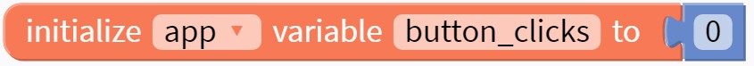
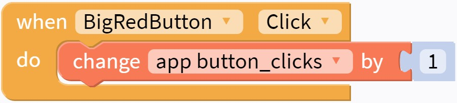
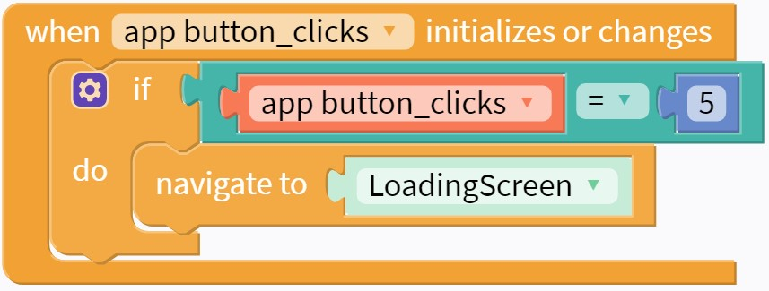

# Switching Screens

This step will walk through "writing code" to tell your app when to switch screens. We are going to start by having the screen switch after clicking the BigRedButton 5 times!

### Counting Clicks
In order to switch screens after 5 clicks, we will need to keep track of the number of clicks in a `variable`.

Open the `Blocks` Tab in the upper left of the screen. Within the `Variables` tray, find the `initialize app variable` block and drag it into your Blocks space. Set the app variable name to `button_clicks` and the value to `0`.

{: style="width:450px"}

Can you get the variable's value to increase by one each time the button gets clicked? Click the Solution below to see one way to do it.

??? success "Solution"
    {: style="width:400px"}

### Switching Screens

Next, we want to switch screens when `button_clicks` reaches 5! The most important block we will use is in the `Control` tray, and it is for navigating to a screen:

{: style="width:300px"}

Can you find a way to run that block when button_clicks is 5? After trying different ways, you can compare to the solution below to see if you found a better way to do it!

??? success "Solution"
    {: style="width:400px"}

### Test
Now there should be enough functionality to test the app and make sure it works so far! When you Live Test the app, does the screen change after pushing the button 5 times?

### Next Step

In the next step we will add a third screen, which will be our app's homepage.