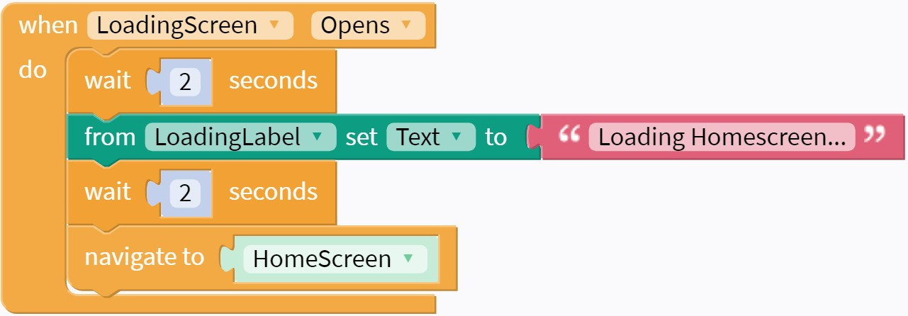

# Homepage
In this step we will create a homescreen for the application, which can be used to navigate to other screens.

### Adding HomeScreen

Using the skills from [part 2 of this lesson](./l02-02-login-screen.md), create a new screen named "HomeScreen."

{: style="width:500px"}

Add a Label to this page that says something like "Welcome to your homepage!"

### Navigating to HomeScreen
We need to set up the LoadingScreen so that it navigates to the HomeScreen. Can you set up blocks in the LoadingScreen so that it will automatically navigate to the HomeScreen after a couple seconds?

See the Hint for some Blocks that might come in handy.

??? help "Hint"
    In the `Control` tray:

    {: style="width:260px"}

    In the `LoadingScreen` tray:

    {: style="width:400px"}

??? success "Solution"
    {: style="width:600px"}

    Notice that there is an extra action included, for additional text on the loading screen!

### Next Step
You should now have an app that allows you to "sign-in", navigating you to a loading page. After a couple seconds on the loading screen, the home screen should open.

For inspiration on how to customize your screen navigation, click on "Next" below.

Future lessons will customize the homepage and add additional pages to go to from the homepage!